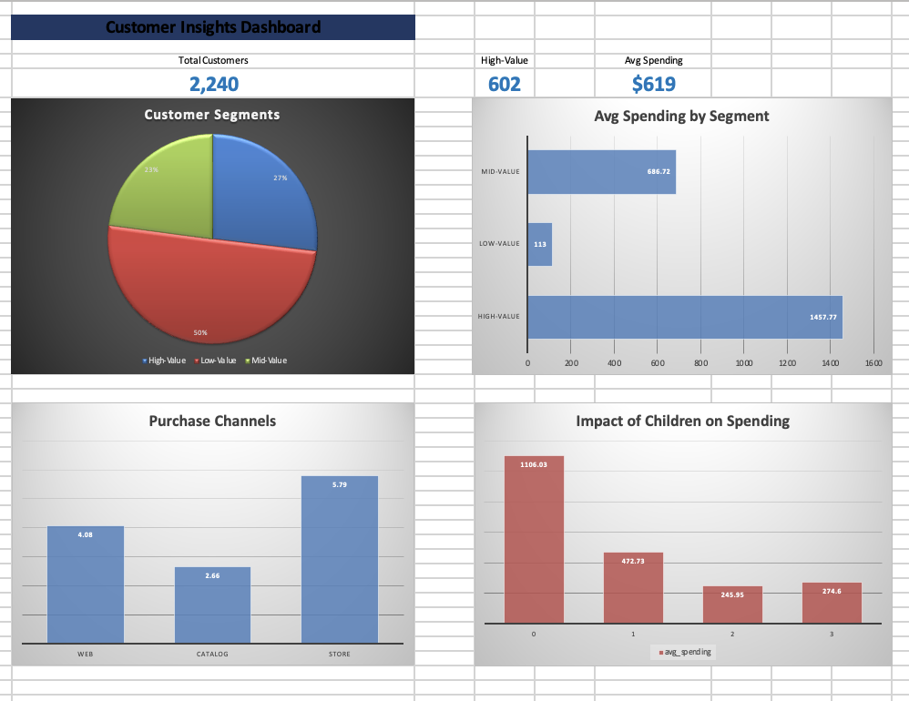

# Customer Insights Analysis

> Segmentation analysis on 2,240+ customers to identify high-value clusters, churn risk patterns, and purchase behavior — using SQL, Python, and Excel.

---

## Dashboard Preview



---

## Project Objective

Analyze a real-world customer dataset to:
- Identify and segment customers by spending behavior
- Surface high-value customer clusters (top 20%)
- Understand the impact of family structure on spending
- Map preferred purchase channels
- Deliver findings through a clean, interactive Excel dashboard

---

## Key Insights

| Insight | Finding |
|---|---|
| High-Value customers | 27% of customers, avg spend **$1,457** |
| Low-Value customers | 50% of customers, avg spend only **$113** |
| Children impact | Customers with no children spend **4.5x more** |
| Top purchase channel | In-store (5.79 avg) > Web (4.08) > Catalog (2.66) |
| Retention target | Top 20% high-value segment identified for campaign |

---

## Tech Stack

| Tool | Usage |
|---|---|
| **PostgreSQL** | Data storage & SQL analysis |
| **Python** | Data cleaning, segmentation, export |
| **pandas** | Data manipulation & aggregation |
| **psycopg2** | PostgreSQL connection |
| **openpyxl** | Excel report generation |
| **Excel** | Interactive dashboard & visualizations |

---

## Project Structure

```
customer-insights-analysis/
│
├── data/
│   └── marketing_campaign.csv       # Raw dataset (2,240 customers)
│
├── sql/
│   └── analysis_queries.sql         # All SQL queries used
│
├── python/
│   └── customer_analysis.py         # Analysis & export script
│
├── output/
│   └── customer_insights_report.xlsx  # Final Excel dashboard
│
└── README.md
```

---

## How to Run

### 1. Setup PostgreSQL

```bash
psql -U postgres -c "CREATE DATABASE customer_insights;"
```

### 2. Create Table & Import Data

```bash
psql -U postgres -d customer_insights -c "
CREATE TABLE customers (
    id INTEGER PRIMARY KEY,
    year_birth INTEGER,
    education VARCHAR(50),
    marital_status VARCHAR(50),
    income NUMERIC(12,2),
    kidhome INTEGER,
    teenhome INTEGER,
    dt_customer DATE,
    recency INTEGER,
    mntwines INTEGER,
    mntfruits INTEGER,
    mntmeatproducts INTEGER,
    mntfishproducts INTEGER,
    mntsweetproducts INTEGER,
    mntgoldprods INTEGER,
    numdealspurchases INTEGER,
    numwebpurchases INTEGER,
    numcatalogpurchases INTEGER,
    numstorepurchases INTEGER,
    numwebvisitsmonth INTEGER,
    acceptedcmp1 INTEGER,
    acceptedcmp2 INTEGER,
    acceptedcmp3 INTEGER,
    acceptedcmp4 INTEGER,
    acceptedcmp5 INTEGER,
    complain INTEGER,
    z_costcontact INTEGER,
    z_revenue INTEGER,
    response INTEGER,
    totalspending INTEGER,
    segment VARCHAR(20)
);"

psql -U postgres -d customer_insights -c "\COPY customers (id, year_birth, ...) FROM 'marketing_campaign.csv' DELIMITER E'\t' CSV HEADER;"
```

### 3. Run Python Analysis

```bash
pip install pandas psycopg2-binary openpyxl
python customer_analysis.py
```

---

## SQL Analysis Highlights

```sql
-- Customer Segmentation
UPDATE customers SET segment =
    CASE
        WHEN totalspending >= 1000 THEN 'High-Value'
        WHEN totalspending >= 400  THEN 'Mid-Value'
        ELSE 'Low-Value'
    END;

-- Segment Summary
SELECT segment,
       COUNT(*) as count,
       ROUND(AVG(income), 2) as avg_income,
       ROUND(AVG(totalspending), 2) as avg_spending
FROM customers
GROUP BY segment
ORDER BY avg_spending DESC;

-- Impact of Children on Spending
SELECT kidhome + teenhome as num_children,
       COUNT(*) as customers,
       ROUND(AVG(totalspending), 2) as avg_spending
FROM customers
GROUP BY num_children
ORDER BY num_children;
```

---

## Dashboard Features

- **3 KPI Cards** — Total Customers, High-Value Count, Avg Spending
- **Pie Chart** — Customer segment distribution
- **Bar Chart** — Avg spending by segment
- **Column Chart** — Purchase channel comparison
- **Column Chart** — Impact of children on spending

---

## Dataset

- **Source:** [Customer Personality Analysis — Kaggle](https://www.kaggle.com/datasets/imakash3011/customer-personality-analysis)
- **Size:** 2,240 rows × 29 columns
- **Type:** Real-world marketing campaign data

---

## Business Recommendations

1. **Focus retention efforts** on the 602 High-Value customers (27%)
2. **Re-engage** Low-Value segment with targeted deals & promotions
3. **Invest in in-store experience** — highest purchase channel
4. **Target childless customers** for premium product campaigns

---

## Author

** Wagih Emad **
BI Developer | Data Analyst
> *Building data-driven solutions for real business problems.*
